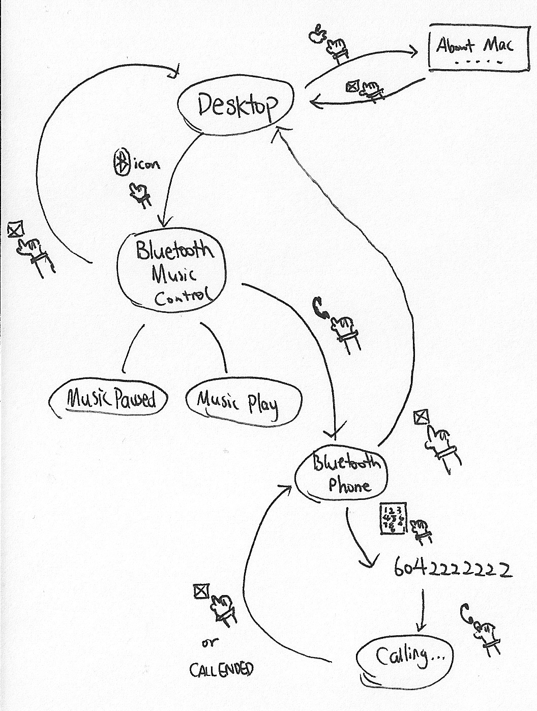

#  Mac 128K Bluetooth Music Player
I designed this player for the interest of recreating the design of the original Macintosh 128K. There isn't really a need that this project is aiming to solve, it's merely for collection purpose. I won't be able to buy one anymore, so why shouldn't I make one myself?

## Update (Feb 8, 2015)
Now with illuminated Apple Logo!

## What was this project built for?
During the summer of 2014, I attended Stanford Summer College at which I studied CS106B (Programming Abstractions in C++) and EE47 (PressPlay: Interactive Device Design).

This bluetooth music player was created for the final project of the EE47 course.

## Criteria
> Although you have, at this point, built a basic MP3 player that actually plays MP3s, you can see that you are still a ways away from having a full-fledged working device. Issues such as use scenarios, conceptual models, mechanical skins or housings, and interface designs have yet to be worked out. Your ideas have yet to reach the “proof of concept” phase, where you show that what you envision can be built, much less the degree of validation that comes from “proof through use” where you can assess whether your designs actually function in the arena you intended. The goal of this final project is for you to have a fully functioning and well-designed MP3 player of your own design.

> Your project is to design and build a MP3 player to suit a specific application of your choosing. To this end, you have been asked to articulate, through interaction diagrams, interface sketches, and written descriptions, exactly what it is you are proposing to build, and to enumerate what some of the design challenges that you foresee. You should plan on building multiple working iterations of your design to enable increasing levels of refinement towards your point of view, rather than hoping that all the different aspects of the design will miraculously come together just in time for the final presentations.

For more detail, please see [this pdf file](FinalProjectCriteria.pdf).

## Documentation

For documentation, please see [this pdf file](Documentations.pdf).

## Diagrams
Schematics *(click the image to view in high resolution)*

Verplank Diagram *(click the image to view in high resolution)*

State Diagram *(click the image to view in high resolution)*

## More pictures

